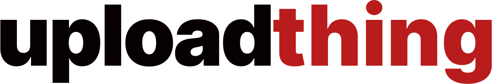
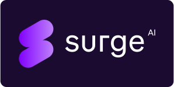

  
  
  

### 👋 About Us

TypeScript's typing system can be very powerful when used correctly. The problem
is that most developers or engineers don't use much more than they have to in
their day to day. Inevitably a moment comes where their knowledge just doesn't
cut it for a use case, and they have to reach out to a community for help. We
aim to be not only the community but the platform they can use to learn more of
the intricacies of TypeScript's typing system.

### ✨ Want to contribute?

Please see the [`LOCAL.md`](/LOCAL.md) on how to get set up. Consider joining the [discord](https://discord.gg/WjZhvVbFHM) if you have any ideas/feedback. We'd love to hear from you!

### 💖 Sponsors

If you find our project interesting and want to support us please consider sponsoring. Your sponsorship would contribute to the advancement of this project and further ensure its ongoing maintenance and improvement for the benefit of the open-source community.

<table>
  <tr>
    <td>
      
    </td>
    <td>
      
    </td>
    <td>
      <a href="https://www.herodevs.com/" target="_parent">
        <picture>
          <source media="(prefers-color-scheme: dark)" srcset="./media/herodevs-dark.png">
          
        </picture>
      </a>
    </td>
  </tr>
  <tr>
    <td>
      <a href="https://www.uploadthing.com/" target="_parent">
        <picture>
          <source media="(prefers-color-scheme: dark)" srcset="./media/uploadthing-logo-dark.svg">
          
        </picture>
      </a>
    </td>
    <td>
      
    </td>
  </tr>
</table>
